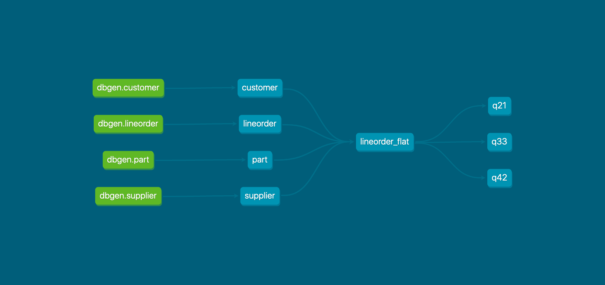
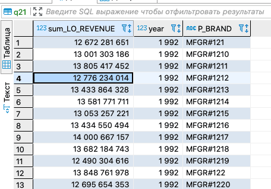
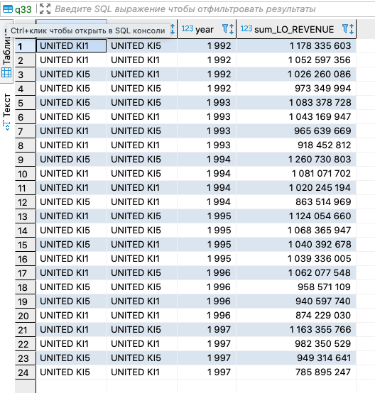
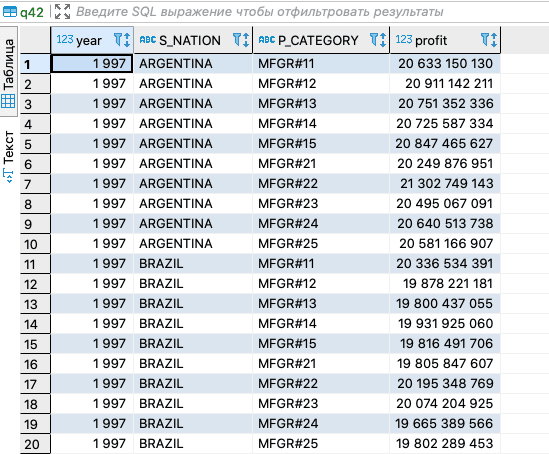

# Домашнее задание 2 курса Data Engeneer

### Проблемы
- После получения токена видимо нужно ждать несколько секунд. Не всегда проходит авторизация при запуске terraform
- Процесс создания кластера занимает  20-40 минут. Это странно, ожидал что будет быстрее
- Если изменить параметры кластера даже пустого, он может необратимо поломаться 
- Не было понятно сразу что макрос dbt run-operation generate_model_yaml --args '{"model_name": "supplier"}' будет работать не сразу а только после создания таблицы 
- в примере https://gist.github.com/kzzzr/8d50126079df1a8e5646342f6247df22 если в скрипте lineorder_flat.sql  есть engine='MergeTree()', то создание таблицы падает. Не стал разбираться и писать новые макросы

### Как и что работает
- В папке yandex-cloud-terraform запускаем  sh initch.sh.
Запускается регенерация токена для доступа к яндекс облаку, поднимается c помощью терраформ сеть и кластер clickhouse 
- Если ипользуется виртуальное окружение поднимаем его pipenv shell 
- Запускаем  dbt run
- Ждем когда  поднимется кластер и соберутся наши таблицы
- можно запускать DBeaver смотреть результаты в наших витринах 
- Собираем документацию и модели 

### Модель данных

### Результаты работы

### Resources:
- Как прокидывать переменные среды в конфиг terraform [Документация](https://www.terraform.io/docs/cli/config/environment-variables.html#tf_var_name) Чтобы не нужно было писат свой токен на гитхаб
- Learn more about dbt [in the docs](https://docs.getdbt.com/docs/introduction)
- Check out [Discourse](https://discourse.getdbt.com/) for commonly asked questions and answers
- Join the [chat](https://community.getdbt.com/) on Slack for live discussions and support
- Find [dbt events](https://events.getdbt.com) near you
- Check out [the blog](https://blog.getdbt.com/) for the latest news on dbt's development and best practices
